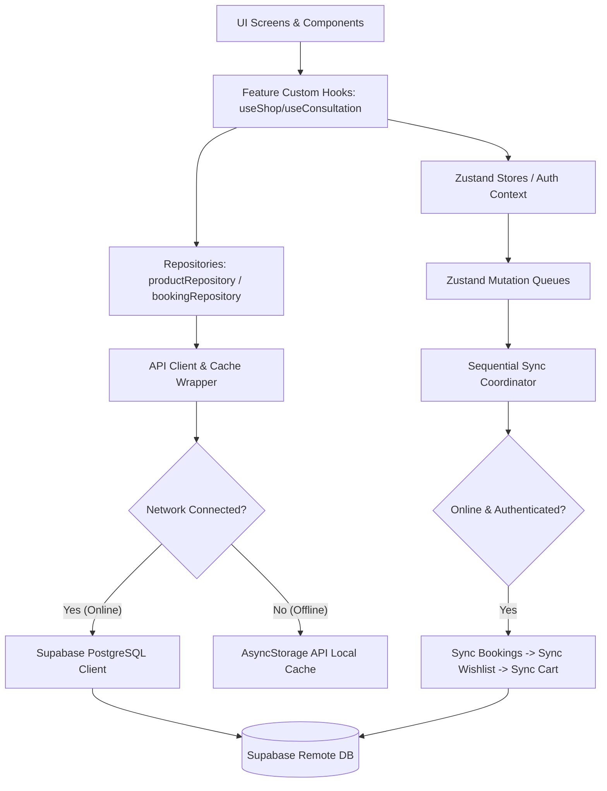

# Amrutam Pharmaceuticals Application Architecture & Engineering Documentation

This documentation provides an in-depth breakdown of the architecture, design choices, engineering decisions, and implementation strategies for the Amrutam Pharmaceuticals application. 

---

## 1. Project Overview

### Purpose
Amrutam Pharmaceuticals is a hybrid React Native and Web application built on the Expo SDK 57 framework. The application delivers a multi-faceted digital health platform:
- **Consultation Suite**: Connecting patients with Ayurvedic, Homeopathic, and General doctors, featuring slot booking and scheduling.
- **Shop & Pharmacy**: Offering natural health products with catalog browsing, searching, real-time inventory management, a wishlist, and a cart.
- **Health Records**: Enabling patients to store, catalog/tag, view, and query medical records, prescriptions, and lab reports.

### Technology Stack
- **Framework**: Expo SDK 57 (Expo Router for navigation, Expo UI components).
- **Language**: TypeScript (strict-mode compilation).
- **State Management**: Zustand (local state, reactive stores, offline queues and persistence).
- **Backend / Database**: Supabase (PostgreSQL database, RLS security policies, Auth session management).
- **Local Persistence**: React Native AsyncStorage (for API cache and state persistence) & `expo-secure-store` (for sensitive biometric/auth storage).
- **Testing Suite**: Jest & React Test Renderer (integrated unit testing, repository isolation testing, and offline coordinator simulation).

---

## 2. Directory Layout & Folder Structure

```text
src/
├── app/                  # File-based navigation structure (Expo Router routes and tabs)
├── components/           # Reusable presentation and layout components (cross-features)
├── context/              # React Context providers (Auth Context & user session tracking)
├── features/             # Feature-sliced modules (Consultation, Health Records, Shop)
│   ├── consultation/     # Components, custom hooks, and utility functions for doctor bookings
│   ├── records/          # Health record attachment helpers, hook definitions, and components
│   └── shop/             # Product catalog pages, wishlist/cart components, and filters
├── services/             # Core infrastructure services and external adapters
│   ├── api/              # API client, latency simulators, error wrappers, and caching
│   ├── repositories/     # Data access layer (Supabase clients vs. local mock fallbacks)
│   └── *.ts              # Biometrics, feature flags, global networking, sync services
├── store/                # Zustand client store files (state persistence and mutation queues)
└── types/                # Strict TypeScript declaration files (database schemas, error boundaries)
```

### Module Responsibilities

1. **`src/app`**: Acts as the router registry. It defines the tab paths (`/doctors`, `/shop`, `/bookings`, `/records`, `/profile`) and gates routes using auth checks or biometric overrides.
2. **`src/components`**: Contains global UI utilities such as `<BiometricGate />` (security lock overlay), `<ConnectionBanner />` (live connectivity banner), and the custom Toast alert components.
3. **`src/features`**: Implements the feature-sliced pattern. Each domain module encapsulates its own views, custom state-mapping hooks (`useShop`, `useConsultation`, `useRecords`), and specialized unit tests. This prevents features from polluting each other's codebases.
4. **`src/services`**: Centralizes low-level I/O. The repositories translate app requests into Supabase queries or locally simulated database responses. The sync coordinator synchronizes offline work queues.
5. **`src/store`**: Zustand store (`clientStore.ts`) manages active global states, offline queues, and local item configurations. It uses custom storage adapter bindings.
6. **`src/context`**: Houses `AuthContext.tsx` which tracks active Supabase user credentials and triggers data reconciliation upon sign-in.
7. **`src/types`**: Declares types for validation, database tables, and API query query strings to enforce compile-time error checks.
8. **`src/__tests__`**: Houses test files (unit, repository, UI integration) that reflect the directory structure of the actual code.

---

## 3. Architecture & Data Flow

Detailed application interaction flow:



### Flow Definitions:
* **Authentication Gating**: Upon bootstrapping, the `AuthProvider` listens to Supabase auth events. On transitions (sign-in or register), user-specific data is reconciled via `reconciliationService.ts`. On user sign-out, Zustand state caches, local data stores, and transient parameters are instantly cleared to maintain isolation boundaries.
* **Repository Architecture**: Repositories abstract raw Supabase connections. When `isSupabaseConfigured` is enabled, the repository issues calls using the Supabase client. When it is disabled (e.g. inside local environments or test suites), it falls back to a deterministic seeded random data generator (`mockData.ts`).
* **Domain Model Layering**: Database schemas (which utilize snake_case columns such as `image_url` and `consultation_fee`) are mapped inside repositories to camelCase domain models (`imageUrl`, `consultationFee`) using helper mapping boundaries.

---

## 4. Architectural Decisions

The table below outlines key engineering choices, reasons for inclusion, and associated trade-offs:

| Decision | Choice | Reason | Trade-off |
| :--- | :--- | :--- | :--- |
| **Directory Layout** | Feature-Sliced Modules combined with Shared Core Services | Clear separation of concerns; isolates views and tests to domain boundaries. | Slightly higher directory nested lookup paths for deep imports. |
| **Data Fetching Layer** | Repository Pattern | Centralizes query logic; allows transparent fallbacks between Supabase and mocked offline mock datasets. | Requires mapping functions to convert database schemas into clean domain interfaces. |
| **Backend Provider** | Supabase SDK | Out-of-the-box support for user authentication, auto token refresh, Row-level Security (RLS), and Postgres storage. | Creates a dependency on Supabase Client APIs and connection pooling. |
| **Global State** | Zustand | Lightweight compared to Redux; has simple middleware integration (`persist`), and doesn't suffer from React context re-render thrashing. | Lacks native time-travel debugger tools out of the box. |
| **Authentication State** | React Context (`AuthContext`) | Keeps standard session listener mounted at the application root for stable React lifecycle access. | Re-renders components consuming `useAuth` when auth details change. |
| **Local Cache Storage** | AsyncStorage | Native support in React Native; simple key-value storage suitable for caching serialized JSON catalogs. | Web performance is bounded by browser localStorage performance; not secure for cryptographic tokens. |
| **Sensitive Storage** | `expo-secure-store` | Hardware-backed keystore/keychain access on iOS/Android; prevents extraction of session secrets. | Fallback to secure in-memory mapping (`Map`) required on Web platforms since Web storage lacks OS-level vaults. |
| **Access Gating** | Native Biometrics (`expo-local-authentication`) | Enhanced security overlay; prompts biometrics (`unlock`) on app foregrounding when preference is enabled. | Web platform always bypasses authentications because native biometric APIs are absent. |
| **Configuration Control** | Strongly Typed env Feature Flags (`featureFlags.ts`) | Allows enabling/disabling features (like Biometric lock or Shop Checkout) via environment variables without editing code. | Requires code synchronization to maintain clean variables across CI pipelines. |
| **Offline Mutations** | Write-Ahead Transaction Queues | Ensures that cart updates, wishlist changes, and bookings are not lost when offline. | Requires reconciliation and deduplication logic during state syncing. |
| **Type Verification** | Compile-Time Assertions & Unions | Ensures safety at runtime. Enforced via Postgres schema bindings and explicit domain union models. | Leads to longer compile-type analysis times during local bundling. |


---

## 5. State Management

The application segments states across three core scopes:
1. **React Context (`AuthContext`)**: Holds the active `User`, `Session`, and global database `Profile` objects. 
2. **Local Component State**: Maintains local items such as the active doctor query string, date picker states, input fields, and UI toggle variables.
3. **Zustand Store (`clientStore.ts`)**: Integrates global states, local cart selections, wishlist IDs, local network connection state trackers, and offline queues.

### Offline Queueing & Flow
Zustand actions (e.g. modifying cart quantity or toggling a wishlist icon) call mutator helpers that run background tasks:
1. When online, the action is dispatched both to the local store and mapped directly to remote database tables.
2. When offline, a mutation task (e.g. `WishlistQueueItem` or `CartQueueItem`) is generated containing metadata (`type`, `productId`, `quantity`, unique `id`) and placed into a queue.
3. Once the connectivity listener detects a transition back online, the sequential coordinator (`bookingSyncService` and `userSyncService`) flushes the queued requests to the server, clearing them locally upon success.

---

## 6. Performance Optimizations

The application implements several key performance optimizations:

### 1. Pagination & Infinite Scrolling
- **Problem**: Querying the full catalog of products or bookings causes high network latency and memory overhead.
- **Implementation**: `productRepository` uses range constraints (`.range(start, end)`) which are mapped to custom infinite scroll parameters in `useShop.ts`. 
- **Benefit**: Restricts memory usage to a small initial payload and loads additional items on-demand as the user scrolls.
- **Trade-off**: Requires managing page indices and metadata counters in the search hook.

### 2. Request Gating
- **Problem**: Fast clicks or multiple scroll updates can trigger duplicate network requests for the same page.
- **Implementation**: The custom fetch hook (`useShop.ts`) maintains a `loadingRef.inFlight` boolean state:
  ```typescript
  if (loading || isLoadingMore || !hasMore) return;
  if (loadingRef.inFlight) return;
  ```
- **Benefit**: Prevents redundant network requests and reduces database query overhead.
- **Trade-off**: Prevents pre-fetching adjacent pages.

### 3. Race-Condition Protection
- **Problem**: Out-of-order responses from slow network configurations can lead to stale query parameters overwriting newer search results.
- **Implementation**: Maintain a mutable query identifier reference (`queryIdRef.current`):
  ```typescript
  const queryId = ++queryIdRef.current;
  // ... fetch call ...
  if (queryId !== queryIdRef.current) return; // Drop stale response
  ```
- **Benefit**: Guarantees that the UI state matches the user's latest search criteria.
- **Trade-off**: Stale fetched network data is discarded even if it could be cached.

### 4. Filter Pagination Reset
- **Problem**: Modifying category filters or search text while page > 1 can cause empty result sets because the page offset exceeds the matching product count.
- **Implementation**: `updateFilters()` resets `page` back to `1` unless the pagination index itself is explicitly modified:
  ```typescript
  if ('page' in newFilters) {
    nextFilters.page = newFilters.page!;
  } else {
    nextFilters.page = 1;
  }
  ```
- **Benefit**: Prevents blank states when changing search queries or categories.
- **Trade-off**: Prevents returning a user to their previous scroll position when they undo a filter.

### 5. API Caching
- **Problem**: Repeatedly fetching static datasets (such as product details or doctor profiles) creates unnecessary database load and network traffic.
- **Implementation**: Custom `apiCache.ts` leverages AsyncStorage with a 5-minute Time-To-Live (TTL):
  ```typescript
  // Under SUCCESS mode:
  const cached = await apiCache.get<T>(endpoint);
  if (cached && apiCache.isFresh(cached)) {
    return cached.value;
  }
  ```
  A background garbage collection routine (`sweepExpiredEntries`) cleans up stale records.
- **Benefit**: Enables instant transitions between screens when navigating back and forth.
- **Trade-off**: Updates to remote databases can take up to 5 minutes to show up locally unless explicitly cleared.

### 6. List Rendering Optimizations
- **Problem**: Re-rendering long lists during scrolling can lead to dropped frames on low-powered devices.
- **Implementation**: Using unique items IDs as React component keys. In `useShop.ts`, incoming paginated pages are deduplicated using a native `Map`:
  ```typescript
  setProducts((prev) => {
    const map = new Map(prev.map((p) => [p.id, p]));
    for (const item of (result.items || [])) {
      map.set(item.id, item);
    }
    return Array.from(map.values());
  });
  ```
- **Benefit**: Prevents rendering duplicate elements and minimizes frame drops.
- **Trade-off**: Requires map conversions during state updates.


---

## 7. Offline Strategy

```text
               [ Offline App State Flow ]
  +------------------+                   +----------------+
  |  Device Offline  | -- Reads Data --> | API Cache      |
  |                  |                   | (AsyncStorage) |
  +------------------+                   +----------------+
           |
     Enqueue Operation (Cart/Wishlist/Bookings)
           |
           v
  +-------------------+
  |   Zustand Store   | -- Saved to --> AsyncStorage
  | Mutation Queues   |
  +-------------------+
           |
     Connectivity Restored (NetInfo)
           v
  +-----------------------------------------------------------+
  |              Sequential Sync Coordinator                  |
  |                                                           |
  |  1. Flush Bookings (Expire old slots / cancel deletions)  |
  |  2. Synchronize Wishlist Items                            |
  |  3. Synchronize Cart Item Quantities                      |
  +-----------------------------------------------------------+
```

1. **Local API Caching**: Every write transaction routed through the `apiClient` checks local cache entries first if the device is offline.
2. **Transactional Offline Queues**: When performing write operations while offline, rather than failing the transaction, mutations are appended to Zustand-stored queues (`bookingQueue`, `wishlistQueue`, `cartQueue`).
3. **Robust Synchronization Coordinator**: When connectivity is restored, the `triggerSync` coordinator schedules sequential network updates to prevent race conditions:
   - **Step 1: Bookings Sync**: Validates and attempts to commit pending bookings. Booking slot expiration calculations run against a custom `timeProvider` mapping. If slot times have already passed before a sync can occur, the booking is marked as `failed` with the error `Selected slot has expired`. Booking cancellations (`mutationType === 'CANCEL'`) are also routed here and deletion requests are sent to Supabase.
   - **Step 2: Wishlist Sync**: Wishlist changes are batched and flushed to the backend repository.
   - **Step 3: Cart Sync**: Cart item updates are applied to the server database.
4. **Retry Behavior**: If a sync run fails due to network hiccups, the coordinator schedules retries using progressive intervals: 10 seconds, then 20 seconds, and finally 30 seconds. On the third failure, synchronization halts until a new network or user event triggers it again.
5. **Session Expiry Protection**: Under simulated token expiration state overrides (`SESSION_EXPIRED`), client writes fail cleanly and prompt the user to re-authenticate, which clears the cached data.

### Offline Capabilities matrix:
- **Offline Supported Actions**: Browsing cached doctor profiles, browsing cached product catalogs, looking up past health records, adding items to the cart/wishlist, and scheduling a booking.
- **Online-Only Actions**: Signing in or out, updating profiles, downloading new medical reports, and confirming booking checkouts.

---

## 8. Secure Storage & Biometrics

### Secure Storage Layer (`secureStorage.ts`)
The application partitions data storage by sensitivity level:
- **AsyncStorage**: Stores non-sensitive data like the product lists and offline sync items.
- **`expo-secure-store` / Memory Fallback**: Stores cryptographic tokens, authentication details, and biometric configurations.
  - On iOS and Android, this data is saved to native Keychains using hardware encryption keyrings.
  - On Web, to prevent exposing sensitive tokens in unencrypted local storage, a private `Map` object maintains sessions in-memory.

### Biometric Engine (`biometrics.ts`)
1. **Device Compatibility**: `checkSupport` verifies both hardware availability and active fingerprint/facial registration profiles using `expo-local-authentication`.
2. **Biometric Settings**: The preference toggle is stored securely in Keychain storage using the key `biometric_enabled_pref`. Gating settings or modifying preferences requires authentication verification first before updates are committed:
   ```typescript
   const success = await biometricService.authenticateUser(title);
   if (success) {
     await secureStorage.setItem(BIOMETRICS_PREF_KEY, enabled ? 'true' : 'false');
   }
   ```
3. **Biometric Preference Persistence**: Biometric settings are **independent of your login session state**. Logging out does not delete biometrics settings. This allows users to lock the application on shared devices regardless of whether they have an active database session.
4. **Biometric Gate Component (`biometric-gate.tsx`)**: Mounted globally inside the root `_layout.tsx` wrapper template. It monitors AppState changes (`active`, `background`). When the app returns to the foreground, a passcode prompt blocks the UI until the user authenticates.


---

## 9. Feature Flags Architecture

Feature flags are centralized in `src/services/featureFlags.ts` to manage feature access safely.

### Implementation Details:
- **Interface Definition**:
  ```typescript
  export interface FeatureFlags {
    enableBiometricAuth: boolean;
    enableShopCheckout: boolean;
  }
  ```
- **Fallback Resolution**: Priority order is environment variables first, then default values (configured in `DEFAULT_FLAGS`):
  ```typescript
  get: <K extends keyof FeatureFlags>(key: K): FeatureFlags[K] => {
    const envKey = `EXPO_PUBLIC_FLAG_${key.replace(/([A-Z])/g, '_$1').toUpperCase()}`;
    const envVal = process.env[envKey];
    if (envVal !== undefined) {
      return envVal === 'true';
    }
    return DEFAULT_FLAGS[key];
  }
  ```
- **Dynamic Hook**: The `useFeatureFlag` hook returns feature flag values and keeps clean component state bindings:
  ```typescript
  export function useFeatureFlag<K extends keyof FeatureFlags>(key: K): FeatureFlags[K];
  ```

### How to Safely Add a Feature Flag:
1. Open `src/services/featureFlags.ts`.
2. Declare the new key (such as `enableTelehealthCalls: boolean`) inside the interface `FeatureFlags`.
3. Add a default configuration fallback value inside `DEFAULT_FLAGS`.
4. Run check overrides by adding `EXPO_PUBLIC_FLAG_ENABLE_TELEHEALTH_CALLS=true` inside `.env.local` or development environment configurations.
5. In UI files, check the flag value using the hook:
   ```typescript
   const isTelehealthEnabled = useFeatureFlag('enableTelehealthCalls');
   ```

---

## 10. TypeScript Production Engineering

The codebase enforces strict type safety to prevent runtime errors:

### 1. Generated Database Typing (`types/database.ts`)
Maps exact database structures, including tables, columns, relations, and insert/update shapes. 

```typescript
export interface Database {
  public: {
    Tables: {
      doctors: {
        Row: { id: string; seed_index: number; name: string; specialty: string; image_url: string; rating: number; experience: number; consultation_fee: number; available_days: DayOfWeek[]; created_at: string; updated_at: string; };
        // ...
      }
    }
  }
}
```

### 2. Strongly Typed Supabase Client
The client instantiation explicitly receives the `Database` structure to enforce type safety during database operations:

```typescript
export const supabase: SupabaseClient<Database> = createClient<Database>(supabaseUrl, supabaseAnonKey, { ... });
```

Any attempts to write to invalid fields or query missing tables will fail compilation.

### 3. Repository Mapper Typing
Repositories decouple database structures from clean domain entities using mapping functions:

```typescript
type ProductRow = Database['public']['Tables']['products']['Row'];
function mapDbProduct(row: ProductRow): Product {
  return {
    id: row.id,
    name: row.name,
    category: row.category,
    price: Number(row.price),
    description: row.description,
    imageUrl: row.image_url,
    rating: Number(row.rating),
    stock: row.stock,
  };
}
```

This prevents database changes from breaking components that rely on camelCase fields.


### 4. `unknown` Error Handling
Instead of using unsafe `any` error catch blocks, catch blocks use the `unknown` type and route errors through the typed utility `getErrorMessage`:

```typescript
try {
  // ...
} catch (err: unknown) {
  setError(getErrorMessage(err));
}
```

### 5. custom Errors Code Mapping (`types/errors.ts`)
The `AppError` class maps error scenarios to specific application codes:

```typescript
export type AppErrorCode =
  | 'NETWORK_FAILURE'
  | 'TIMEOUT'
  | 'MALFORMED_RESPONSE'
  | 'SESSION_EXPIRATION'
  | 'BOOKING_CONFLICT'
  | 'UNAUTHORIZED'
  | 'UNKNOWN_FAILURE';
```

### 6. Paper Cuts / Href Typing
Link destinations use the generated `Href` type to catch broken internal links at build time:

```typescript
type Props = Omit<ComponentProps<typeof Link>, 'href'> & { href: Href & string };
```

### 7. Zustand Store Type Separation
Zustand stores maintain clear separations between data interfaces and mutator methods:

```typescript
export type ClientStore = ClientState & ClientActions;
```

This prevents components from mutating the store state directly outside of defined actions.

### 8. DateTimePicker Event typing
Standardizes date picker callback signatures:

```typescript
const handleDateSelect = (event: DateTimePickerChangeEvent, selectedDate?: Date);
```

### 9. union Literals (`DayOfWeek`)
Using union types instead of broad string definitions catches invalid days of the week at compile time:

```typescript
export type DayOfWeek = 'Monday' | 'Tuesday' | 'Wednesday' | 'Thursday' | 'Friday' | 'Saturday' | 'Sunday';
```

### 10. Globals Test Declarations
Custom type interfaces are declared globally in `jest-setup.ts` to allow global test configuration helpers without type errors:

```typescript
declare global {
  var clearSecureStoreMemory: () => void;
  var setSecureStoreItemMock: (key: string, value: string) => void;
  var localAuthMock: {
    hasHardware: boolean;
    isEnrolled: boolean;
    authenticateSuccess: boolean;
  };
}
```

---

## 11. Testing Strategy

The test suite validates components, state stores, repositories, and integration flows:

### 1. Isolated Unit Tests
- **Components**: Validates UI layout rendering and accessibility labels (such as `connectionBanner.test.tsx` and `doctorDetail.test.tsx`).
- **Utilities**: Verifies core business helper logic (date manipulations, attachment format checkers in `attachments.test.ts`).

### 2. Repository Isolation Tests
- Employs mock networks and environment flag toggles to confirm repositories behave correctly under both simulated Supabase and local mock data modes.

### 3. UI Integration & Queue Coordinator Tests
- **`sequentialSyncCoordinator.test.tsx`**: Simulates offline state transitions, queue pushes, order priority loops (making sure bookings sync before cart updates), and error handling.
- **`authGating.test.tsx`**: Ensures login redirects function correctly and user switches prevent cross-tenant data leaks.
- **`rlsSecurityEnforcement.test.tsx`**: Verifies that profile updates and deletion requests run only inside authorized user scopes.

### Mocking Strategy (in `jest-setup.ts`)
- **AsyncStorage**: Swapped with a simple in-memory repository to guarantee fast, state-free test environments.
- **NetInfo**: Mocked to simulate connection state changes on-demand.
- **DateTimePicker**: Replaced with a React Native Mock View to keep test runs environment-independent and headless-friendly.
- **SecureStore**: Replaced with a transient in-memory map.


---

## 12. Engineering Trade-offs

| Implementation Choice | Selected Option | Alternative Considered | Trade-off Impact |
| :--- | :--- | :--- | :--- |
| **Offline Synchronization** | Sequential Client Coordinator Sync | Real-time background sync workers | Sequential synchronization running in the main JS thread simplifies queue order management, but can slightly block the main thread during heavy network operations. |
| **API Cache Storage** | Simple AsyncStorage JSON serialization | SQLite or WatermelonDB database engines | JSON-serialized AsyncStorage caches are easier to debug and mock, but perform worse than SQLite when storing thousands of entries. |
| **Web Secure Storage** | Volatile Private Memory Map | Browser WebCrypto API or localStorage | Volatile memory maps protect user sessions from unencrypted disk storage, but sessions will reset when the browser tab is refreshed. |
| **Data Fetch fallback** | Fallback mock datasets inside app client | Dedicated local mock service worker (MSW) | Built-in fallback logic simplifies local development and works out-of-the-box on native devices, but increases development bundle sizes. |

---

## 13. Future Improvements (Not Implemented)

Key areas for future development:
1. **Automated Supabase Type Generation**: Setting up CI webhooks to automatically pull schema configuration typings from Supabase on database migrations.
2. **End-to-End (E2E) Testing**: Integrating Detox (on iOS/Android) and Playwright (on Web) to run full checkout flows.
3. **Observability & Error Tracking**: Adding Sentry to track runtime client crashes and monitor API network errors.
4. **Advanced Cache Invalidation**: Implementing stale-while-revalidate (SWR) fetching patterns and selective cache sweeps.
5. **Offline Conflict Resolution**: Adding Last-Write-Wins (LWW) resolution strategies for collaborative data tables (like multi-device carts).
6. **Remote Feature Flag Management**: Connecting feature flags to a remote dashboard (such as LaunchDarkly) rather than env file templates.
7. **Performance Monitoring**: Tracking app startup times and layout frame rates (using react-native-performance).
8. **CI Lint Enforcement**: Setting up branch guards to reject PRs with build errors or pending typescript validation issues.

---

## 14. Verification Commands

The following commands are configured and verified for development:

```bash
# Verify TypeScript compile safety:
npx tsc --noEmit

# Run all automated test suites:
npx jest --runInBand --forceExit

# Run code style linter (Expo Linter):
npm run lint

# Export compilation bundles for static Web serving:
npx expo export -p web
```

---

## 15. Core Engineering Principles

The Amrutam Pharmaceuticals codebase is built on these core engineering principles:

- **Strong Type Safety**: Typing configurations, client requests, and errors catches type bugs before deployment.
- **Clear Separation of Concerns**: Isolating presentations, feature logic, and network abstractions into distinct modules.
- **Strict Data Ownership**: Preventing cross-tenant data leaks and keeping auth sessions securely isolated.
- **Offline Resilience**: Designing features around network unavailability using transactional write queues and caches.
- **Defensive Asynchronous Programming**: Preventing race conditions, duplicate fetches, and stale state updates using request gating.
- **Test-Driven Refactoring**: Maintaining test suites that catch regressions when making changes.

